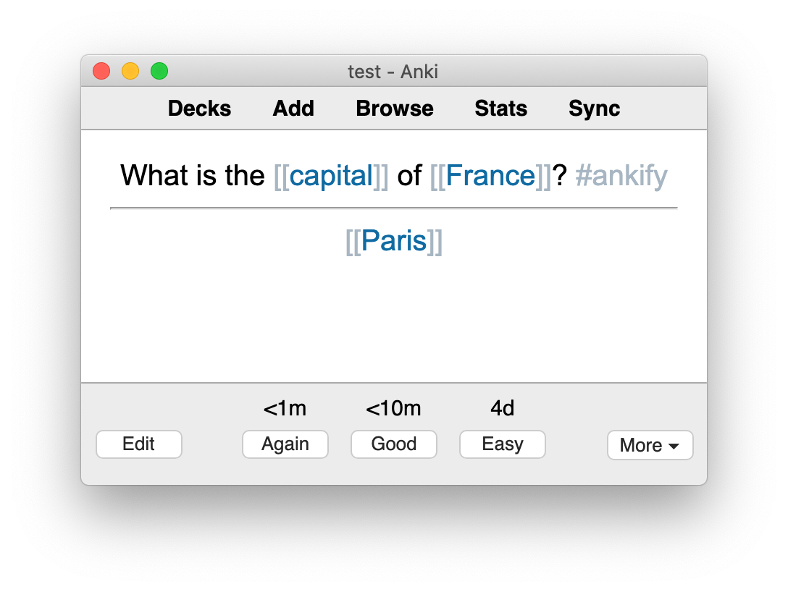

# Ankify Roam

A command-line tool for importing flashcards from Roam into Anki.

<table border=0px>
<tr>
<td width=300px>
    
</td>
<td><div>→</div></td>
<td width=300px>
    <div>
        
    </div>
</td>
</tr>
</table>


## Installation

```
pip install ankify_roam
```

## Requirements

- Python >=3.6
- [Anki](https://apps.ankiweb.net/)
- [AnkiConnect](https://github.com/FooSoft/anki-connect)
    - Open the Install Add-on dialog by selecting Tools | Add-ons | Browse & Install in Anki.
    - Input 2055492159 into the text box labeled Code and press the OK button to proceed.
    - Restart Anki when prompted to do so in order to complete the installation of AnkiConnect.

## Getting Started

### 1. Ankify Roam

Define a card by adding the #ankify tag. By default the block will be converted into a Basic card with the block content on the front and it's children on the back: 

- What is the capital of France? #ankify
    - Paris

You can also create cloze deletions with curly brackets. If the block tagged with #ankify has any cloze deletions, then it'll be converted to a Cloze card. You can explicitely define the cloze ids or have ankify_roam infer them. Here's an example of cloze markup in Roam and what it becomes in Anki:

<table width=500px>
<tr>
    <td>
        <div>{1:Paris} is the capital and most populous city of {2:France}, with a estimated population of {2,148,271} residents #ankify</div>
    </td>
</tr>
<tr>
    <td align="center">↓<td>
</tr>
<tr>
    <td>
        <div>{{c1::Paris}} is the capital and most populous city of {{c2::France}}, with a estimated population of {{c3::2,148,271}} residents #ankify</div>
    </td>
</tr>
</table>

### 2. Export Roam

Once you've tagged all the blocks to ankify, export your Roam: 
1. Click on the ... in the top right corner
2. Select Export All > JSON > Export All
3. Unzip the downloaded file.

### 3. Open Anki

Open Anki. Make sure you're on the profile you'd like to add the cards to and that you've installed the [AnkiConnect](https://github.com/FooSoft/anki-connect) add-on.

### 4. Create Roam specific card types 

Running the following will create 2 new card types in anki for your Roam flashcards: 'Roam Basic' and 'Roam Cloze'
```
ankify_roam init
```
### 5. Add the Roam export to Anki

```
ankify_roam add my_roam.json
```
The blocks you tagged in Roam should now be in Anki!

### 6. Repeat

When you tag new blocks to ankify or edit ones you've already imported to Anki, you'll need to export your database again, and then rerun `ankify_roam add` on the export. This will add any newly tagged blocks and update the existing ones with any changes you've made.  

## Options

Instead of specifying the Roam export json, you can specify the exported zip file or give the directory it's in and ankify_roam will add the latest export in there.
```
ankify_roam add Roam-Export-1592525007321.zip
ankify_roam add ~/Downloads
```

Use a different tag than #ankify:
```
ankify_roam add --tag-ankify=flashcard my_roam.json
```  

Use different note types than 'Roam Cloze' and 'Roam Basic'. See [TODO] for more details on creating compatible note types. 
```
ankify_roam add --default-basic="My Basic" --default-cloze="My Cloze" my_roam.json
``` 
Same thing for the deck to add to:
```
ankify_roam add --deck="Biology" my_roam.json
```
Specify the deck and note type on a per-card basis: 

- 2+2={4} #[[[[ankify]]:deck=Math]] #[[[[ankify]]:model=My Cloze]]

TODO: cover all features in this section so that I don't need a separate documentation section

## Fancy stuff

### Styling the cloze markup

You can also use curly bracket page links to define cloze deletions:


The nice thing about doing it this way is that you can now style the cloze markup:
1. Press `Ctrl-C Ctrl-B` in Roam to hide the square brackets surrounding page links.
2. Add this css to your [[roam/css]] page (how to [video here](https://www.youtube.com/watch?v=UY-sAC2eGyI)) to change the color of the curly brackets:
```css
span[data-link-title="{"] > span,
span[data-link-title="}"] > span
{
  color: #DDDCDC !important;
}
```

Now you can #ankify Roam to your hearts content without #uglifying it too: 


### Uncloze Namespaces

When you add a cloze deletion around a namespaced page reference, you have the option to leave the namespace out of it: 
```
ankify_roam add --pageref-cloze=base_only my_roam.json
```

With that option, a cloze deletion like this in Roam...


...will look like this in Anki:


### Creating and editing Anki note types

#### Include a "uid" field

When creating your own note type, the most important thing you need to do is create a field called "uid". 

This field is used by ankify_roam to remember which block in Roam corresponds with which note in Anki. Without this field, when you make a change to a block in Roam, ankify_roam will add that block as a new note in Anki rather than updating the existing one.

#### Suggested CSS modifications

Hide all Roam tags 
```
.rm-page-ref-tag {
    display: none;
}
```

Hide page reference brackets
```
.rm-page-ref-brackets {
    display: none;
}
```

Hide bullet points to simulate "View as Document" in Roam:
```
li {
    list-style-type: none;
}
```