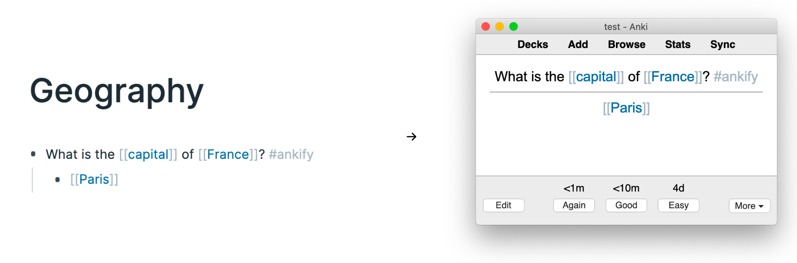

# Ankify Roam

A command-line tool which brings flashcards created in [Roam Research](https://roamresearch.com/) to [Anki](https://apps.ankiweb.net/).



## Main Features

- Create front/back and cloze deletion flashcards in Roam and import to Anki.
- Supports block references, images, and aliases.
- [Include parent blocks](#Show-parent-blocks) on your Anki cards 
- Make edits in Roam to flashcards you've already imported and sync the changes to Anki. 
- Uses similar HTML syntax to Roam so you can style your Anki cards just like you do Roam.
- [Add color to or hide cloze deletion markup in Roam](#Add-color-or-hide-cloze-deletions-in-Roam).

## Contents
1. [Main Features](#Main-Features)
1. [Installation](#Installation)
1. [Requirements](#Requirements)
1. [Basic Usage](#Basic-Usage)
1. [Options](#Options)
1. [Customize Anki and Roam](#Customize-Anki-and-Roam)
1. [Sync Automatically](#Sync-Automatically)
1. [Problems](#Problems)


## Installation

```
pip install ankify_roam
```

## Requirements

- Python >=3.6
- [Anki](https://apps.ankiweb.net/)
- [AnkiConnect](https://ankiweb.net/shared/info/2055492159) (add-on for Anki)

## Basic Usage

### 1. Ankify Roam

Ankify a block (ie. flag it to go to Anki) by adding the #ankify tag to it. The tag must be included in the block itself, *it cannot be inherited from it's parents.*

By default, the block will be converted into a front/back style Anki note with the block content on the front and it's children on the back:

> - What is the capital of France? #ankify
>     - Paris

If the block includes any [cloze deletions](https://docs.ankiweb.net/#/editing?id=cloze-deletion), ankify_roam converts it to a cloze style Anki note. Add a cloze deletion by surrounding text in curly brackets: 

> {Paris} is the capital and most populous city of {France}, with a estimated population of {2,148,271} residents #ankify

In the example above, ankify_roam will add incremental cloze ids for each cloze deletion. But you can also explicitly define them (or a mixture of both). Here's an example showing what cloze markup in Roam becomes in Anki:


<table border=0px>
<tr>
<td>
        <div>{Paris} is the capital and most populous city of {2:France}, with a estimated population of {2,148,271} residents #ankify</div>
</td>
<td><div>→</div></td>
<td>
    <div>
        <div>{{c1::Paris}} is the capital and most populous city of {{c2::France}}, with a estimated population of {{c3::2,148,271}} residents #ankify</div>
    </div>
</td>
</tr>
</table>

Cloze ids matching the following patterns are all supported by ankify_roam: "c1:", "c1|", "1:" 


### 2. Export Roam

Once you've tagged all the blocks to ankify, export your Roam: 
1. Click on the "more options" button in the top right corner of Roam.
2. Select Export All > JSON > Export All to export your Roam graph.
3. Unzip the downloaded file.

### 3. Open Anki

Open Anki. Make sure you're on the profile you'd like to add the cards to and that you've installed the [AnkiConnect](https://ankiweb.net/shared/info/2055492159) add-on.

### 4. Create Roam note types (first time only) 

Create 2 new note types in Anki: 'Roam Basic' and 'Roam Cloze'. These are the note types which your flashcards in Roam will be added as. 

Steps to create a 'Roam Basic' note type:
- Go to Tools > Manage Note Types and click on "Add"
- Select the "Add: Basic" option the click "OK"
- Name it "Roam Basic"
- With `Roam Basic` selected, click on "Fields..." and add a field called "uid" 
- With `Roam Basic` selected, Click on "Cards..." 
- Replace the css in "Styling" with the contents of [roam_basic.css](css/roam_basic.css)
- Click "Save"

Steps to create a 'Roam Cloze' note type:
- Go to Tools > Manage Note Types and click on "Add"
- Select the "Add: Cloze" option the click "OK"
- Name it "Roam Cloze"
- With `Roam Cloze` selected, click on "Fields..." and add a field called "uid" 
- With `Roam Cloze` selected, Click on "Cards..."
- Replace the css in "Styling" with the contents of [roam_cloze.css](css/roam_cloze.css)
- Click "Save"

(You can also create your own note types, and have ankify_roam populate those. For details, see [Create custom note types](#create-custom-note-types).)

### 5. Add the Roam export to Anki

```
ankify_roam add my_roam.json
```
(Replace "my_roam.json" with the filename of the json within the zip you downloaded in [step 2](#2.-Export-Roam))

Your flashcards should now be in Anki! 

### 6. Repeat

Whenever you create new flashcards in Roam or edit the existing ones, repeat these same steps to update Anki with the changes.  

## Options

### Roam Export Path

The path to your exported Roam graph can refer to the json, the zip containing the json, or the directory which the zip is in. When a directory is given, ankify_roam will find and add the latest export in it. In my case, all 3 of these commands do the same thing:
```
ankify_roam add my_roam.json
ankify_roam add Roam-Export-1592525007321.zip
ankify_roam add ~/Downloads
```

### Choose a different ankify tag

To use a tag other than #ankify to flag flashcards, pass the tag name to `--tag-ankify`: 
```
ankify_roam add --tag-ankify=flashcard my_roam.json
```  

... and if there are some blocks which include the #flashcard tag but you actually *don't* want ankify_roam to ankify it, add another tag (eg. #not-a-flashcard) and then tell ankify_roam by passing it to `--tag-dont-ankify`: 
```
ankify_roam add --tag-ankify=flashcard --tag-dont-ankify=not-a-flashcard my_roam.json
```  

### Change the default deck and note types

To import your flashcards to different note types than the default 'Roam Basic' and 'Roam Cloze', pass the note type names to `--note-basic` and `--note-cloze` (see [Create custom note types](#Create-custom-note-types) for details):
```
ankify_roam add --note-basic="My Basic" --note-cloze="My Cloze" my_roam.json
``` 

To import your flashards to a different deck than "Default", pass the deck name to `--deck`:
```
ankify_roam add --deck="Biology" my_roam.json
```

You can also specify the deck and note type on a per-note basis using tags in Roam: 

> - 2+2={4} #[[ankify_roam: deck="Math"]] #[[ankify_roam: note="Cloze for math"]]

(When a deck or note type is specified using a tag on the block, those will take precedence over the deck and note type specified at the command line.)

### Show parent blocks

To show the parents of your ankified block, pass a number of parents (or "all") to `--num-parents`. 

Here's an example where we specified that all parents should be included:

```
ankify_roam add --num-parents=all Geography.json
```


Notice that "Geography" is shown differently from the rest of the parents. By default, the top level parent is shown as a title and all other parents are shown as breadcrumbs underneath. Because we included all parents, the top level parent for both blocks was the page name. But that's not always the case, as I'll show in the next example.

You can also use a tag to specify the `num-parents` on a single block. In this example, the `num-parents` was set to 2 using an inline tag:


This ankified block has 3 parents: first parent is "[[Frace]]", the second is "Capitals", and the third is "Geography". Since `num-parents` was set to 2, only "[[Frace]]" and "Capitals" was included. In this case, "Capitals" was the top most parent included, so it's now the one displayed as a title. 


### Cloze delete the base name only

When you add a cloze deletion around a namespaced page reference, eg. 


... you can tell ankify_roam to only cloze delete the base name part of the page reference, leaving out the namespace, eg.


... by setting the `--pageref-cloze` option to "base_only":
```
ankify_roam add --pageref-cloze=base_only my_roam.json
```

You can also set this on an individual note:

> - The {[[Design Pattern/Adaptor Pattern]]} specifies... #[[ankify_roam: pageref-cloze="base_only"]] 

## Customize Anki and Roam

### Create custom note types

As mentioned in the [options](#Change-the-default-deck-and-note-types) section, you can import to different note types than the default 'Roam Basic' and 'Roam Cloze' types [provided](#4.-Create-Roam-note-types-(first-time-only)). Those note types will need to satisfy 2 requirements to be compatible with ankify_roam:   

1. **The first field(s) is for content from Roam (first 2 for Basic and 1 for Cloze)**. When ankify_roam converts a Roam block into an Anki note, it takes the content of the block and places it into the first field of the Anki note. For basic notes, it also takes the content of the block's children and adds them to the second field. The names of these fields doesn't matter, it just matters that they come first in the field order.

1. **Include an additional field called "uid"**. In addition to those fields, a "uid" field is required. This field is used by ankify_roam to remember which block in Roam corresponds with which note in Anki. Without this field, when you make a change to a block in Roam, ankify_roam will add that block as a new note in Anki rather than updating the existing one.

If you are going to make your own note types, I'd suggest you create [clones](https://docs.ankiweb.net/#/editing?id=adding-a-note-type) of the 'Roam Basic' and 'Roam Cloze' note types and then just edit the style of those clones (see [here](https://www.youtube.com/watch?v=F1j1Zx0mXME&yt:cc=on) for a tutorial).


### CSS ideas for your Anki cards

Hide all Roam tags (eg. the #ankify tag)
```css
.rm-page-ref-tag {
    display: none;
}
```

Hide page reference brackets.
```css
.rm-page-ref-brackets {
    display: none;
}
```

When a block has multiple children, they're added as bullet points on the backside of a card. If you'd prefer not to show the bullets, similar to the "View as Document" option in Roam, use the following CSS:
```css
.back-side ul {
    list-style-type: none;
    text-align: left;
    margin-left: 0;
    padding-left: 0;
}
```


### Add color or hide cloze deletions in Roam

You can also define cloze deletions using curly bracket inside square brackets:


The nice thing about doing it this way is that you can now style the cloze markup. 

For example, you can make the cloze brackets only faintly visible by:
1. Pressing `Ctrl-C Ctrl-B` in Roam to hide the square brackets surrounding page links.
2. Adding this css to your [[roam/css]] page (how to [video here](https://www.youtube.com/watch?v=UY-sAC2eGyI)) to change the color of the curly brackets:
```css
span[data-link-title="{"] > span,
span[data-link-title="}"] > span
{
  color: #DDDCDC !important;
}
```

Now the block shown above will look like this: 


Note: Just like the regular cloze markup, the page links can also include cloze ids eg. [[{c1:]]Paris[[}]] 

## Sync Automatically 
It is possible to set up automatic updates of Anki using [Roam To Git](https://github.com/MatthieuBizien/roam-to-git). 

Follow the instructions on the Roam to Git page for setting up an automatically updating repository on GitHub. Clone that repository to your local machine: 
```git clone https://github.com/YOURNAME/notes```

Now you can run 

```ankify_roam add /PATH_TO_YOUR_REPO/notes/json/YOURDBNAME.json``` 

And further, you can add the git update to crontab:  
```echo "15 * * * * 'cd PATH_TO_YOUR_REPO;git pull;PATH_TO_ANKIFY/ankify_roam add PATH_TO_YOUR_REPO/json/YOURDBNAME.json '" | crontab ```  

Now you'll have git Roam to Git cloning your notes from Roam on the hour, and fifteen minutes later any updates/new items will be pulled in Anki, as long as it is running.


## Problems

### Missing Features
- No LaTeX support
- No syntax highlighting for code blocks

### Non-Intuitive Behaviour
- If you change a flashcard's field content in Anki, that change will be overwritten with whatever is in Roam the next time you run ankify_roam. So make those changes in Roam, not Anki.
- When a flashcard in Roam has already been imported to Anki, the only changes made in Roam which will be reflected in Anki are changes to the fields. Changes to it's tags, deck, and note type need to be done manually in Anki.
- If you move the content of a block into a new block in Roam, ankify_roam will treat that as a new flashcard. This is because ankify_roam uses the block uid and the Anki uid field to know which block corresponds with which Anki note.
- Deleting a flashcard in Roam doesn't delete it in Anki. You'll need to delete it in Anki manually.
- A flashcard deleted in Anki will be re-imported to Anki next time you run ankify_roam if you don't also delete it or remove the #ankify tag in Roam. 
- When you let ankify_roam infer the cloze ids, you can get some weird behaviour when you add a new cloze deletion to a note in Roam which was already imported to Anki. For example, if you have "Paris is the capital of {France}" in Roam, that'll become "Paris is the capital of {{c1::France}}" in Anki. Later, if you add a cloze deletion around Paris ie. "{Paris} is the capital of {France}", ankify_roam will convert that into "{{c1::Paris}} is the capital of {{c2::France}}". Notice that the "France" cloze id is now "c2" instead of "c1". This is because ankify_roam assigns cloze ids in the order that the cloze deletions appear. The result is that in Anki the original flashcard will now cloze delete "Paris" instead of "France" and a new flashcard will be added which cloze deletes "France". To avoid this, explicitely add cloze ids in Roam which match the existing note in Anki eg. "{2:Paris} is the capital of {1:France}"
